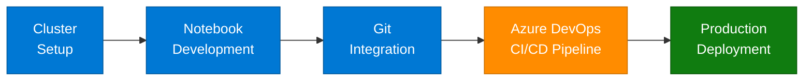

<div align="center">

# Controle e Versionamento de Código no Notebook da Azure

[English Version](./README.md#english-version)

</div>

## 🖼️ Imagem Hero


Este projeto, proposto pela **DIO** e desenvolvido por mim, demonstra como utilizar o Azure Databricks para versionamento e organização de notebooks em ambientes de dados. A proposta inclui a criação de clusters, importação de arquivos, execução parametrizada de notebooks e integração com Azure DevOps para controle de código e automação de esteiras de CI/CD. São exploradas as funcionalidades nativas do Databricks para desenvolvimento em Python e Spark, facilitando a criação de notebooks interativos com filtros, sumarizações, visualizações e comentários explicativos. Também são abordadas boas práticas de organização, exportação e reaproveitamento de notebooks, bem como o uso de recursos do Microsoft Learn, que oferecem exercícios guiados e roteiros de aprendizado. A abordagem permite trabalhar de forma colaborativa, segura e com versionamento estruturado em ambientes de análise, engenharia de dados e machine learning dentro da plataforma Azure.

## Insights e Possibilidades

### Integração com DevOps
A integração do Azure Databricks com o Azure DevOps proporciona um fluxo de trabalho completo para desenvolvimento, teste e implantação de notebooks. Isso permite:

- Controle de versão eficiente dos notebooks
- Automação de testes e validação de código
- Implantação contínua em ambientes de produção
- Rastreabilidade de alterações e colaboração entre equipes

### Funcionalidades de Desenvolvimento do Databricks
O Databricks oferece um ambiente completo de desenvolvimento com autocompletar, execução célula a célula e integração nativa com Spark, acelerando a criação e validação de notebooks:

```python
# Exemplo de pipeline de processamento com PySpark no Databricks
# Leitura de CSV, filtragem de nulos e cálculo de estatísticas básicas
from pyspark.sql.functions import col, count, avg, min, max

df = spark.read.format("csv").option("header", "true").load("/path/to/data.csv")
df_filtered = df.filter(~col("column_name").isNull())
df_stats = df_filtered.select(
    count("*").alias("total_records"),
    avg("numeric_column").alias("average_value"),
    min("numeric_column").alias("min_value"),
    max("numeric_column").alias("max_value")
)
display(df_stats)
```

### Organização e Reaproveitamento
A estruturação adequada de notebooks permite:

- Criação de bibliotecas de funções reutilizáveis
- Modularização de código para manutenção simplificada
- Compartilhamento de componentes entre projetos
- Documentação integrada e autoexplicativa

## Processo de Trabalho com Azure Databricks

### 1. Criação e Configuração de Clusters

O processo começa com a criação de clusters otimizados para as necessidades específicas do projeto:

```python
# Configuração programática de cluster via API
from databricks.sdk import WorkspaceClient
from databricks.sdk.service import compute

w = WorkspaceClient()

cluster_config = compute.ClusterSpec(
    cluster_name="MeuClusterDatabricks",
    spark_version="11.3.x-scala2.12",
    node_type_id="Standard_DS3_v2",
    autoscale=compute.AutoScale(min_workers=1, max_workers=5),
    spark_conf={
        "spark.databricks.delta.preview.enabled": "true",
        "spark.databricks.io.cache.enabled": "true"
    },
    autotermination_minutes=60
)

cluster = w.clusters.create(cluster_config)
print(f"Cluster criado com ID: {cluster.cluster_id}")
```

### 2. Importação e Organização de Arquivos

A importação de arquivos pode ser feita via interface ou programaticamente:

```python
# Importação de arquivos para o DBFS
dbutils.fs.cp("file:/local/path/arquivo.csv", "dbfs:/FileStore/datasets/arquivo.csv")

# Listagem de arquivos importados
files = dbutils.fs.ls("dbfs:/FileStore/datasets/")
display(files)
```

### 3. Versionamento com Git e Azure DevOps

Integração com repositórios Git para controle de versão:

```bash
# Comandos executados no terminal do Databricks
git init
git remote add origin https://dev.azure.com/minha-org/meu-projeto/_git/databricks-notebooks
git add .
git commit -m "Versão inicial dos notebooks"
git push -u origin master
```

No notebook Databricks:
```python
# Verificação do status do repositório
%sh
git status
git log --oneline -5
```

### 4. Automação de CI/CD com Azure DevOps

Exemplo de pipeline YAML para automação:

```yaml
# azure-pipelines.yml
trigger:
- main

pool:
  vmImage: "ubuntu-latest"

steps:
- task: UsePythonVersion@0
  inputs:
    versionSpec: "3.8"
    addToPath: true

- script: |
    pip install databricks-cli pytest
    databricks configure --token
    echo $(DATABRICKS_TOKEN) | databricks configure --token
  displayName: "Configurar CLI do Databricks"

- script: |
    databricks workspace import_dir ./notebooks /Shared/Projeto
  displayName: "Implantar notebooks"

- script: |
    pytest ./tests
  displayName: "Executar testes"
```

### 5. Execução de Notebooks com Parâmetros

Execução parametrizada para flexibilidade:

```python
# Definição de widgets para parâmetros
dbutils.widgets.text("data_inicio", "2023-01-01", "Data Início")
dbutils.widgets.text("data_fim", "2023-12-31", "Data Fim")

# Recuperação dos parâmetros
data_inicio = dbutils.widgets.get("data_inicio")
data_fim = dbutils.widgets.get("data_fim")

# Uso dos parâmetros na consulta
df = spark.sql(f"""
SELECT *
FROM tabela_dados
WHERE data BETWEEN \'{data_inicio}\' AND \'{data_fim}\'
""")

display(df)
```

### 6. Visualizações e Análises Interativas

Criação de visualizações avançadas:

```python
# Importação de bibliotecas para visualização
import matplotlib.pyplot as plt
import seaborn as sns

# Preparação dos dados
resultados = spark.sql("""
SELECT categoria, SUM(valor) as total
FROM vendas
GROUP BY categoria
ORDER BY total DESC
LIMIT 10
""").toPandas()

# Criação de visualização
plt.figure(figsize=(10, 6))
sns.barplot(x=\'categoria\', y=\'total\', data=resultados)
plt.title(\'Total de Vendas por Categoria\')
plt.xticks(rotation=45)
plt.tight_layout()
display()
```

## Recursos de Aprendizado

O Microsoft Learn oferece recursos valiosos para aprofundar o conhecimento em Azure Databricks:

- [Introdução ao Azure Databricks](https://learn.microsoft.com/pt-br/training/modules/intro-to-azure-databricks/)
- [Engenharia de Dados com Azure Databricks](https://learn.microsoft.com/pt-br/training/paths/data-engineer-azure-databricks/)
- [Ciência de Dados com Azure Databricks](https://learn.microsoft.com/pt-br/training/paths/perform-data-science-azure-databricks/)

## Conclusão

O Azure Databricks, quando combinado com práticas adequadas de versionamento e organização de código, proporciona um ambiente robusto e colaborativo para projetos de dados. A integração com Azure DevOps e o uso das funcionalidades nativas da plataforma elevam a produtividade e a qualidade dos notebooks, permitindo que equipes trabalhem de forma mais eficiente em projetos complexos de análise, engenharia de dados e machine learning.


## Fluxo de Trabalho

O diagrama abaixo resume o ciclo completo de desenvolvimento e entrega de notebooks no Azure Databricks com integração DevOps:


## 📄 Licença

Este projeto está licenciado sob a licença MIT. Consulte o arquivo `LICENSE` para mais informações.

---

<div align="center">

# English Version

[Versão em Português](./README.md#controle-e-versionamento-de-código-no-notebook-da-azure)

</div>

## 🖼️ Hero Image


This project, proposed by **DIO** and developed by me, demonstrates how to use Azure Databricks for versioning and organizing notebooks in data environments. The proposal includes creating clusters, importing files, executing parameterized notebooks, and integrating with Azure DevOps for code control and CI/CD pipeline automation. It explores the native capabilities of the Databricks platform for Python and Spark development, facilitating the creation of interactive notebooks with filters, summaries, visualizations, and explanatory comments. Best practices for organizing, exporting, and reusing notebooks are also covered, as well as the use of Microsoft Learn resources, which offer guided exercises and learning paths. The approach enables collaborative, secure, and structured versioning in data analysis, data engineering, and machine learning environments within the Azure platform.

## Insights and Possibilities

### DevOps Integration
Azure Databricks integration with Azure DevOps provides a complete workflow for developing, testing, and deploying notebooks. This allows for:

- Efficient version control of notebooks
- Automation of code testing and validation
- Continuous deployment in production environments
- Traceability of changes and collaboration between teams

### Databricks Development Features
Databricks provides a full-featured development environment with autocomplete, cell-by-cell execution, and native Spark integration, accelerating the creation and validation of notebooks:

```python
# Example PySpark processing pipeline in Databricks
# Read CSV data, filter null records, and calculate basic statistics
from pyspark.sql.functions import col, count, avg, min, max

df = spark.read.format("csv").option("header", "true").load("/path/to/data.csv")
df_filtered = df.filter(~col("column_name").isNull())
df_stats = df_filtered.select(
    count("*").alias("total_records"),
    avg("numeric_column").alias("average_value"),
    min("numeric_column").alias("min_value"),
    max("numeric_column").alias("max_value")
)
display(df_stats)
```

### Organization and Reuse
Proper notebook structuring allows for:

- Creation of reusable function libraries
- Modularization of code for simplified maintenance
- Sharing components between projects
- Integrated and self-explanatory documentation

## Azure Databricks Workflow

### 1. Cluster Creation and Configuration

The process begins with creating clusters optimized for specific project needs:

```python
# Programmatic cluster configuration via API
from databricks.sdk import WorkspaceClient
from databricks.sdk.service import compute

w = WorkspaceClient()

cluster_config = compute.ClusterSpec(
    cluster_name="MyDatabricksCluster",
    spark_version="11.3.x-scala2.12",
    node_type_id="Standard_DS3_v2",
    autoscale=compute.AutoScale(min_workers=1, max_workers=5),
    spark_conf={
        "spark.databricks.delta.preview.enabled": "true",
        "spark.databricks.io.cache.enabled": "true"
    },
    autotermination_minutes=60
)

cluster = w.clusters.create(cluster_config)
print(f"Cluster created with ID: {cluster.cluster_id}")
```

### 2. File Import and Organization

Files can be imported via the interface or programmatically:

```python
# Importing files to DBFS
dbutils.fs.cp("file:/local/path/file.csv", "dbfs:/FileStore/datasets/file.csv")

# Listing imported files
files = dbutils.fs.ls("dbfs:/FileStore/datasets/")
display(files)
```

### 3. Versioning with Git and Azure DevOps

Integration with Git repositories for version control:

```bash
# Commands executed in the Databricks terminal
git init
git remote add origin https://dev.azure.com/my-org/my-project/_git/databricks-notebooks
git add .
git commit -m "Initial notebook version"
git push -u origin master
```

In the Databricks notebook:
```python
# Checking repository status
%sh
git status
git log --oneline -5
```

### 4. CI/CD Automation with Azure DevOps

Example YAML pipeline for automation:

```yaml
# azure-pipelines.yml
trigger:
- main

pool:
  vmImage: "ubuntu-latest"

steps:
- task: UsePythonVersion@0
  inputs:
    versionSpec: "3.8"
    addToPath: true

- script: |
    pip install databricks-cli pytest
    databricks configure --token
    echo $(DATABRICKS_TOKEN) | databricks configure --token
  displayName: "Configure Databricks CLI"

- script: |
    databricks workspace import_dir ./notebooks /Shared/Project
  displayName: "Deploy notebooks"

- script: |
    pytest ./tests
  displayName: "Run tests"
```

### 5. Executing Notebooks with Parameters

Parameterized execution for flexibility:

```python
# Defining widgets for parameters
dbutils.widgets.text("start_date", "2023-01-01", "Start Date")
dbutils.widgets.text("end_date", "2023-12-31", "End Date")

# Retrieving parameters
start_date = dbutils.widgets.get("start_date")
end_date = dbutils.widgets.get("end_date")

# Using parameters in the query
df = spark.sql(f"""
SELECT *
FROM data_table
WHERE date BETWEEN \'{start_date}\' AND \'{end_date}\'
""")

display(df)
```

### 6. Interactive Visualizations and Analysis

Creating advanced visualizations:

```python
# Importing visualization libraries
import matplotlib.pyplot as plt
import seaborn as sns

# Data preparation
results = spark.sql("""
SELECT category, SUM(value) as total
FROM sales
GROUP BY category
ORDER BY total DESC
LIMIT 10
""").toPandas()

# Creating visualization
plt.figure(figsize=(10, 6))
sns.barplot(x=\'category\', y=\'total\', data=results)
plt.title(\'Total Sales by Category\')
plt.xticks(rotation=45)
plt.tight_layout()
display()
```

## Learning Resources

Microsoft Learn offers valuable resources to deepen knowledge in Azure Databricks:

- [Introduction to Azure Databricks](https://learn.microsoft.com/en-us/training/modules/intro-to-azure-databricks/)
- [Data Engineering with Azure Databricks](https://learn.microsoft.com/en-us/training/paths/data-engineer-azure-databricks/)
- [Data Science with Azure Databricks](https://learn.microsoft.com/en-us/training/paths/perform-data-science-azure-databricks/)

## Conclusion

Azure Databricks, when combined with appropriate versioning and code organization practices, provides a robust and collaborative environment for data projects. Integration with Azure DevOps and the use of the platform's native productivity features enhance productivity and notebook quality, allowing teams to work more efficiently on complex data analysis, data engineering, and machine learning projects.


## Workflow

The diagram below summarizes the full development and delivery cycle for notebooks in Azure Databricks with DevOps integration:



## 📄 License

This project is licensed under the MIT License. See the `LICENSE` file for more information.

